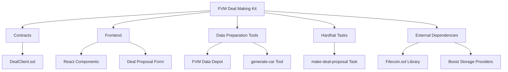

```mermaid
graph TD
    A[FVM Deal Making Kit] --> B[Contracts]
    A --> C[Frontend]
    A --> D[Data Preparation Tools]
    A --> E[Hardhat Tasks]

    B --> B1[DealClient.sol]
    
    C --> C1[React Components]
    C --> C2[Deal Proposal Form]
    
    D --> D1[FVM Data Depot]
    D --> D2[generate-car Tool]
    
    E --> E1[make-deal-proposal Task]
    
    F[External Dependencies]
    F --> F1[Filecoin.sol Library]
    F --> F2[Boost Storage Providers]
    
    A --> F
```
